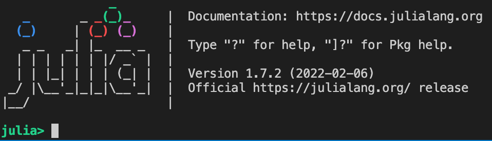

# Installing Julia
Here you can find a simple step-by step guide to installing the Julia language compiler on difference OS.

_N.B. All guidance here pertains only to version 1.7 and greater for Julia_

## Ubuntu
Firstly, within the folder you wish to store the Julia compiler, download the official generic binaries using the following command:
```
wget https://julialang-s3.julialang.org/bin/linux/x64/1.7/julia-1.7.2-linux-x86_64.tar.gz
```
_N.B. Change the version number as needed_
Untar the downloaded file:
```
tar zxvf julia-1.7.2-linux-x86_64.tar.gz
```
Once the file has been untarred, we ideally want to add the Julia compiler to our path. This can be done by modifying `~/.bashrc` or `~/.bash_profile` and adding the following line:
```
export PATH="$PATH:/path/to/<Julia directory>/bin"
```
where `<Julia directory>` is wherever the julia package was untarred.

## Windows
Download the appropriate version of Julia for your device from: https://julialang.org/downloads/. 

Run the installer. When given the option to, check "Add Julia To PATH" as this will make it easier to run julia from the get-go.

## macOS
Download the appropriate version of Julia for your device from: https://julialang.org/downloads/. The installation process is very similar to any usual application downloaded on macOS; simply open the `.dmg` file and move the julia app to the applications folder. 

To run Julia from the command line, however, one will need to add the compiler to PATH. This can be done by running the following code in the root directory of your mac:
```
sudo mkdir -p /usr/local/bin
sudo rm -f /usr/local/bin/julia
sudo ln -s /Applications/Julia-1.7.app/Contents/Resources/julia/bin/julia /usr/local/bin/julia
```

## Starting up Julia
If everything is installed correctly, you can start Julia in the command line using:
```
user@user-name:~$ julia
```
And you should see the following message:
