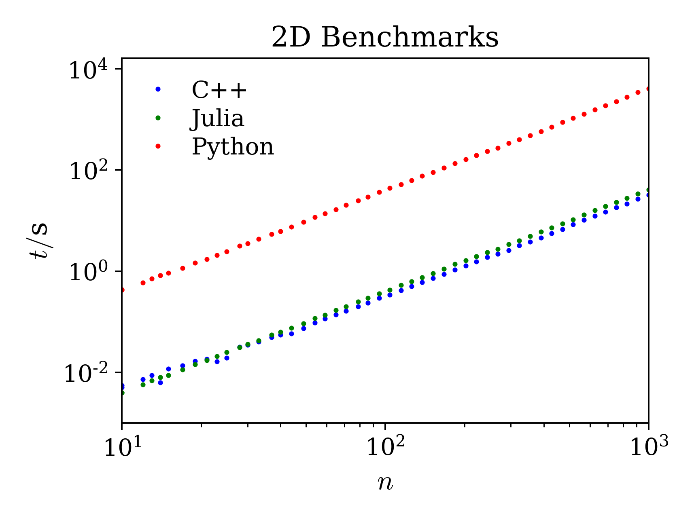

# CUiSING
Welcome to CUiSING! A CUDA-parallelised implementation of the Ising model written in Python, Julia and C++.

This package was developed as part of the CS 179 course requirement in Caltech.

The Ising model is a lattice model in which spins interact via magnetic interactions, and also interact with an externally applied external field. Spins can be in one of two states, up (+) or down (-). The Hamiltonian for the simple Ising model is,
$$H(\{\mathbf{s}\})=-\frac{J}{2}\sum_i\sum_j s_i s_j - h\sum_i s_i$$
where the first sum is over all spins, and their nearest neighbors.

In Markov Chain Monte Carlo (MCMC) a series of moves are attempted, and accepted based on probabilistic criteria to drive the system to the lowest free energy state. In this package, we have implemented the Metropolis-Hastings algorithm which uses the Boltzmann weight from statistical mechanics combined with detailed balance. During the simulation, the spin state will evolve with each iteration, and therefore so will the total energy and magnetization. Detailed balance ensures that the system evolves to the equilibrium state. The energy and magnetization are the main observables of the system, and they are defined as follows,

$$M=\frac{1}{N}\sum_i s_i \\[6pt]
E=H=-\frac{J}{2}\sum_i\sum_j s_i s_j - h\sum_i s_i$$

We normalize the energy such that in a fully aligned system, with no external field, the normalized energy is -1. This is useful for testing purposes so that all trajectories that undergo a transition from random to aligned should have a normalized equilibrium energy of -1.

$$\bar E =\frac{2E}{JNz}$$

where $z$ is the coordination number of the lattice (4 in 2d and 6 in 3d)

## Overview

This package contains many different implementations in different languages that run the same simulation. The goal of each one is the same, to perform Metropolis Monte Carlo on the 2d and 3d Ising model. The purpose of the different implementations is to show differences in speed among various languages on CPU, and GPU. Here, we list all the available codes with a brief description of each:
- **cpp**: a c++ implementation, run fully on CPU
- **cpp-cuda**: a CUDA implementation parallelized on GPU. The GPU kernels are wrapped in C++ code and functions.
  - Requires  cuRAND package, which comes loaded with CUDA
- **Julia**: a Julia implementation, run fully on CPU
- **Julia-cuda**: a CUDA implementation parallelized on GPU. The GPU kernels are wrapped in Julia code and functions. This makes use of **CUDA.jl**
- **python**: a Python implementation, run fully on CPU
- **matlab**: a vectorized matlab implementation, run fully on CPU


## CPU Demo

This package features CPU based implementations in three different programming languages; C++, Julia, and Python. The purpose is to compare the CPU performance of basic Ising monte carlo simulations. Later, parallelization and GPU performance will be compared between the 3 languages as well.

Each of the cpu codes are self contained in their respective folders within CUiSING/. The following sections describe how to run each of the CPU codes.

### C++

To run the C++ code, you must first compile it (if not already compiled). Assuming you are in ```CUiSING/```, the following command will build the C++ executable ```Ising``` within the ```cpp/``` directory.
```
make -C cpp
```
The C++ executable can be run with the following command and the following flags. It can also be called without any flags and the default parameters will be used.
```
./cpp/Ising <n_iters> <d> <n> <J> <h>
```
- **n_iters** = number of MC iterations (default: 1000)
- **d** = spacial dimension, 2 or 3 (default: 2)
- **n** = number of spins along single direction (default: 50)
- **J** = magnetic interaction strength (default: 1.0)
- **h** = external field strength (default: 0.0)

The energy and magnetization trajectories are stored in ```output/cpp_cpu_output.dat```.

### Julia
To run the Julia code from the ```CUiSING/``` directory, run the following command (you must include values for all of the arguments),
```
julia Julia/benchmarking.jl <n_iters> <d> <n> <J> <h>
```
The energy and magnetization trajectories are stored in ```output/julia_cpu_output.dat```
### Python
To run the Python code from the ```CUiSING/``` directory, run the following command (you must include values for all of the arguments),
```
python3 python/benchmarking.py <n_iters> <d> <n> <J> <h>
```
The energy and magnetization trajectories are stored in ```output/python_cpu_output.dat```. Note that the python code is very slow compared to the C++ and Julia code, so you might need to decrease the system size in order to get an output in a reasonable time.

### CPU Benchmarking
Thusfar we have done some work with benchmarking the CPU implementation across different hardware and across the three different languages. The data and figures are stored in ```benchmarking/``` and they are stored by dimension.

The 2d and 3d results as run on Sam's PC (Intel i9-10850k) are given below,


Note that we do recover the proper $n^d$ scaling as expected without any parallelization. This is because each MC iteration requires a loop over all $n^d$ particles in the system.

Pierre has also run some benchmarks with similar results both on his PC (Ryzen 5900X):


 and his 2022 Macbook Pro (ARM):


Benchmarks of all of the methods can be run simultaneously by using the ```CUiSING/benchmarking.py``` within the ```CUiSING/``` folder. You can change the system and iterative parameters within the python file, and then simply run the following command.
```
python3 benchmarking.py
```
The span of $n$ to be benchmarked can be set using the logspace command in line 48 of the script.
```
n = np.logspace(low,high,number).astype(int)
```

## GPU Implementation Intro/Goals

*This part was submitted with the cpu demo at the midpoint of the project. We have since implemented these things. Read beyond for information and results!*

The C++ code has comments above the functions which will be parallelized on the GPU. We plan to implement the following parallelizations in all languages:
- Parallelizing the Hamiltonian calculation by parallelizing the calculation of individual spin energies, using a reduction to add them per block, and then using an atomic add to add up the contributions from each block.
- Parallelizing the Monte Carlo (MC) loop using a checkerboard stencil in which many MC moves can be attempted at once due to the small range of the interactions. Spins that are outside the nearest neighbor cutoff can be flipped simultaneously since their states are independent. This allows us to attempt flipping up to half of the spins at the same time. This will drastically speed up the implementation.
- Lastly, we generate large arrays of random numbers, which can be parallelized on the GPU to generate all of the random numbers at the same time. There are algorithms which can generate arrays in parallel without relying on the system time.
  
We haven't included comments about parallelization in Julia and python because the structure is the same, and the parallelization will be done in the same way across the languages. The difference willl be in the CUDA interface used, whether it be CUDA (C++), pyCUDA (python), or CUDA.jl (Julia). We will implement the same parallelizations across the three different languages using the available functions, and compare their performance. We suspect that the C++-CUDA code will perform the fastest, however, if the Julia-CUDA.jl implementation is close to the performance of the C++-CUDA code, then a case can be made for using Julia since both the CPU and GPU syntax is extremely simple and easy to pick up.

## GPU Results

For the GPU port, we only implemented in C++ and Julia, due to time constraints. These were the main two languages we wanted to compare as these are both commonly used in scientific computing.

### c++ with CUDA

The C++ CUDA implementation is located the ```cpp-cuda/``` directory. Before running the code must be compiled. Depending on the machine, you may need to make changes to the **makefile**, particularly the **CUDA lib and include paths**, the **nvcc path** and the **CUDA gencodes**. The proper gencodes for each GPU architecture and CUDA version can be found at the following link: https://arnon.dk/matching-sm-architectures-arch-and-gencode-for-various-nvidia-cards/.

To compile the ```cpp-cuda``` code, run the following command from the ```CUiSING/``` directory,
```
make -C cpp-cuda
```

To run a simulation, run the following command
```
./cpp-cuda/Ising <n_iters> <d> <n> <J> <h>
```

- **n_iters** = number of MC iterations (default: 1000)
- **d** = spacial dimension, 2 or 3 (default: 2)
- **n** = number of spins along single direction (default: 100)
- **J** = magnetic interaction strength (default: 1.0)
- **h** = external field strength (default: 0.0)

The energy and magnetization trajectories are printed to the file ```output/cpp_gpu_output.dat```. 